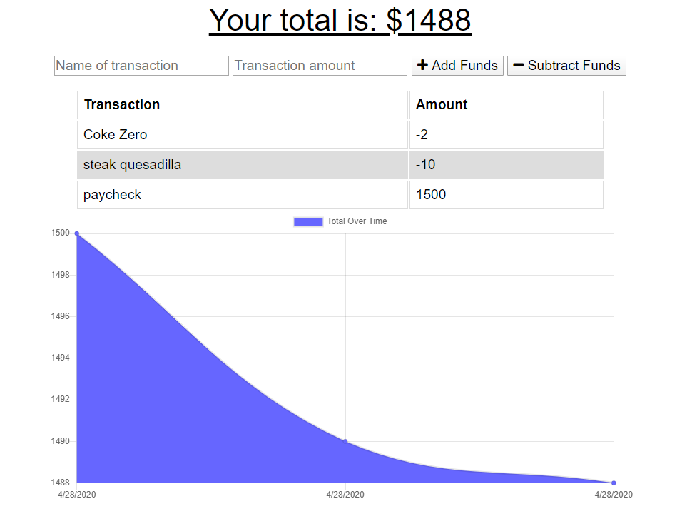

# Budget Tracker PWA
This app demonstrates usage of caching files and service workers. It's a PWA that allows the user to add items expenses or payments to be added to the budget app. The transactions are stored on mongodb. If offline the site loads the last set of budget items from indexdb. Transactions that failed to make it to the database are stored on a pending indexdb data store.

